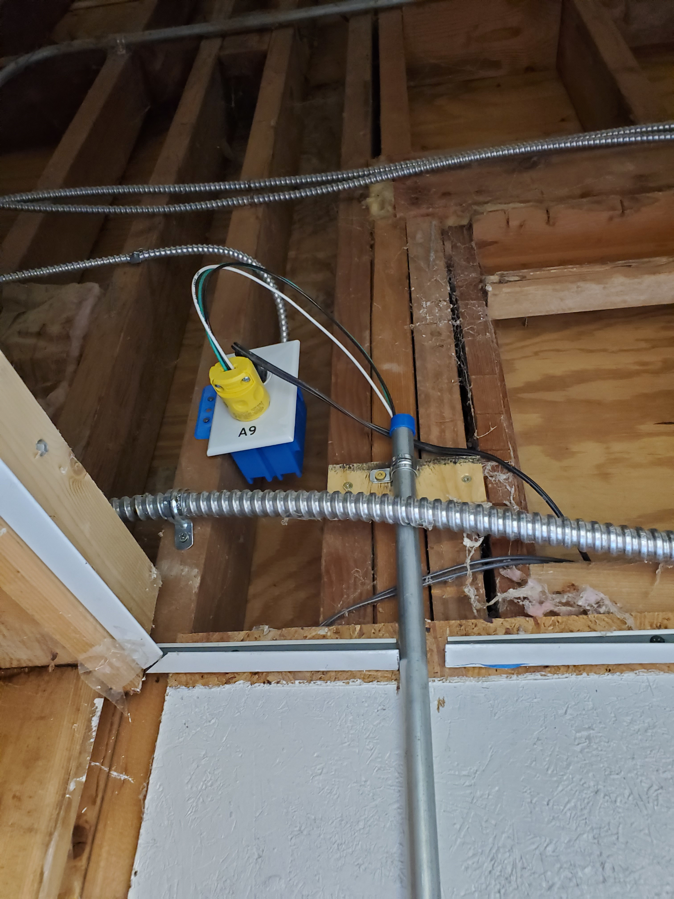

# Hardware v1 - Decatur Makers Raspberry Pi RFID Wiegand Reader

The front (East) door to Decatur Makers makerspace can be opened by active members with their RFID fob.

There is a 120VAC power disconnect (plug) above the drop ceiling:

These fobs are read by an ERK871 RFID reader, which sends both serial and Wiegand style data. We use 26 bit Wiegand fobs as of May, 2021.

The reader is powered by a 120VAC to 24VDC power supply, which is connected to:

* a custom circuit board (top right) that:
  * sends 24V out to the latch retractor motor when triggered
  * sends 12V to power the ERK871 RFID reader and 12V to 5V converter
  * connects to a Raspberry Pi, receiving 3.3V and Ground plus a 3.3v control signal (on pin 22) to trigger the relay controlling the 24V latch retractor motor
* a 12/24VDC to 5VDC converter that powers:
  * the Raspberry Pi
  * an ESP32 that runs [DecaturMakers/esp32-micropython-prometheus](https://github.com/DecaturMakers/esp32-micropython-prometheus) for monitoring of a limit switch in the exit device (push bar) and magnetic sensors on each door

The Raspberry Pi Zero W sends 3V over GPIO pin 1 to both the low voltage side of a logic level converter (to step down the 5V Wiegand data), and to the power supply circuit described above. It also sends 5V over GPIO pin 2 to the high voltage side of the logic level converter.

The Raspberry Pi Zero W receives Weigand data (data0 and data 1) stepped down via the Logic Level Converter to 3V from 5V on GPIO pins 17 and 18. Note that these are numbered 0 and 1 in the WiringPi standard, which is implemented in wiegand_rpi via the WiringPi library. Do not connect Wiegand data sources directly to the raspberry pi as they run at 5V and will damage the Raspberry Pi. Pin 3 is the common ground for the 12V power supply, the RFID reader, and the Raspberry Pi (and its 5V power supply provided by a 12V/5V stepper)

When a fob is passed near the reader, wiegand_rpi interprets the 26 bit fob data and sends the digital "full code" of the fob, a 10-digit number with three leading zeroes, to stdout.
