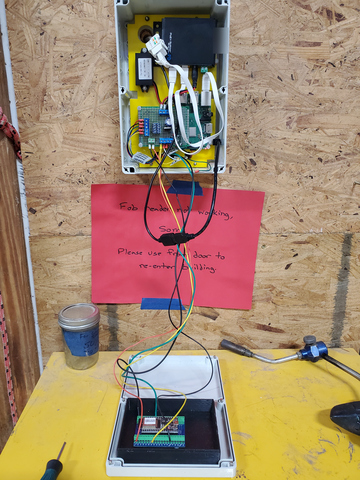
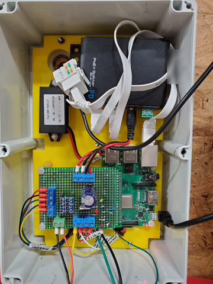
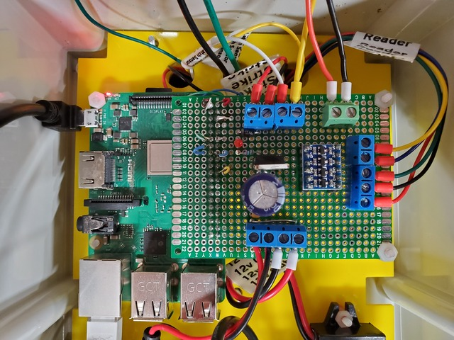
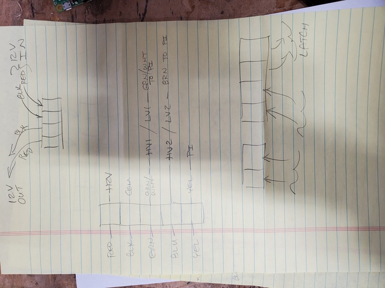
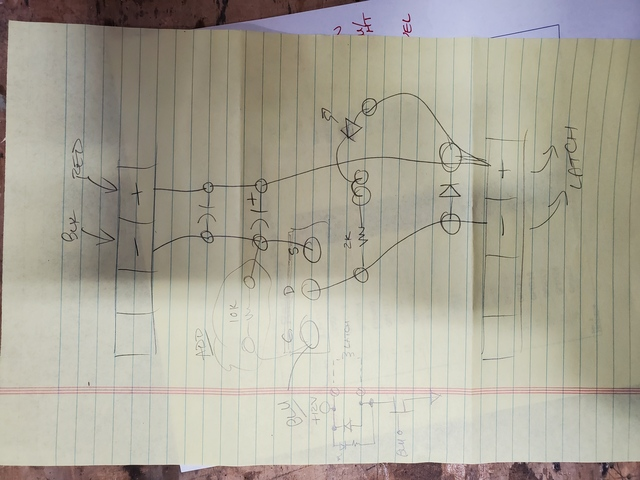
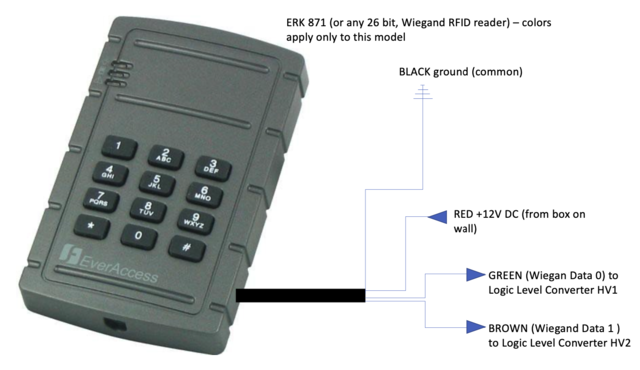
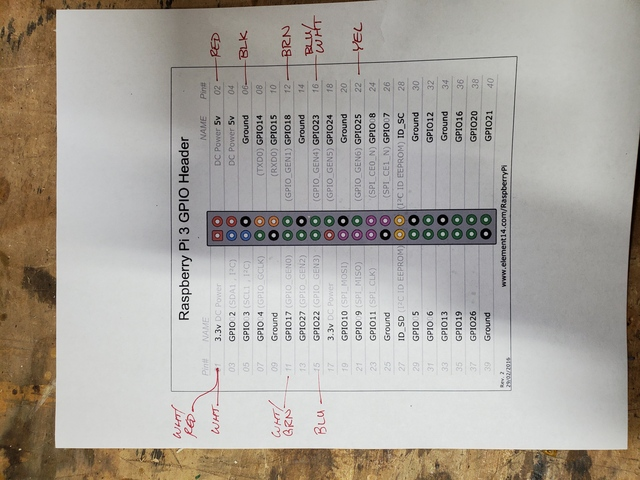
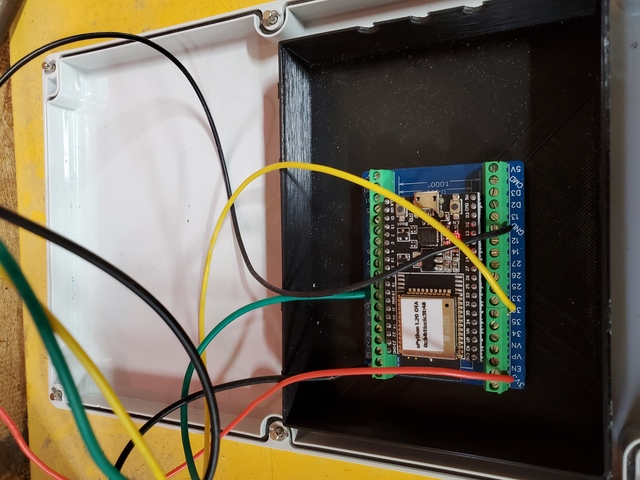

# Hardware v2 - Decatur Makers Raspberry Pi RFID Wiegand Reader

The welding pad side (South) door to Decatur Makers makerspace can be opened by active members with their RFID fob.

The door has a [LSDA PD9000R32D36](https://www.lsda.com/lsda-product/lsda-exit-device-panic-36-rim/) exit device (push bar) on it, with a keyed cylinder [PD9000CDK32D36](https://www.lsda.com/lsda-product/lsda-exit-cylinder-dogging-kit-36-lc-stainless-steel/) dogging kit to allow locking the door *open* with the use of a key. The exit device interfaces with a [HES 9600 630LBM](https://www.hesinnovations.com/en/products/electric-strikes/9600-series) surface-mount fail-secure 12VDC electric strike which is controlled by a relay from the Raspberry Pi.

Wires from the RFID reader, electric strike, and magnetic sensor on the door are routed through the wall and enter the box via holes drilled in it and the panel behind it.

**IMPORTANT** Note about the latch strike monitor/sensor: The latch sensor built in to the electric strike detects when the latch bolt is actually present and captured by the strike. This sensor is read by both the Pi itself and the ESP32, with the latter being used for monitoring the door via Prometheus. In addition to warning us if the door is propped or dogged open, this sensor is vital to the proper functioning of the electric strike. In order to actually capture the latch and lock the door when the door closes, the electric strike must be locked when the door closes. The strike monitor sensor is used to re-lock the electric strike once someone physically opens the door, so that the strike will be locked when the door swings shut.

The Raspberry Pi (and ESP32) are powered via Power Over Etherner (PoE) from the building's main network switch; a pair of Cat6 cables are run behind the wall, one in use for this plus a spare. A [Linovision industrial PoE+ splitter](https://www.amazon.com/gp/product/B09BQZ5ZX3/) is used to pull PoE off the Etherner run and output 12VDC; the data signal is then hooked to the Raspberry Pi for wired Ethernet connectivity.

The 12VDC output from the PoE splitter goes to the top right screw terminals on the custom circuit board on the Pi. Further power distribution is:

* 12VDC out from that board to a 12VDC to USB converter, to power the Pi itself (screw terminals to the left of the power in)
* 12VDC out from that board to power the RFID reader (red and black from screw terminals along the left edge of the board)
* software-controlled 12VDC to open the electric strike (rightmost pair of screw terminals along the bottom edge of the board)
* 5VDC out from the Pi itself, to power the ESP32 (green screw terminal block along the bottom edge of the board)

These fobs are read by an ERK871 RFID reader, which sends both serial and Wiegand style data. We use 26 bit Wiegand fobs as of May, 2021. When a fob is passed near the reader, wiegand_rpi interprets the 26 bit fob data and sends the digital "full code" of the fob, a 10-digit number with three leading zeroes, to stdout.

Wiring for the board to the Raspberry Pi is as follows:

The ESP32 runs [DecaturMakers/esp32-micropython-prometheus](https://github.com/DecaturMakers/esp32-micropython-prometheus) for monitoring of the electric strike latch monitor output and magnetic sensor on the door. The latch strike monitor is read by both the ESP32 and the Pi, with the Pi handling pull up of the line. 

